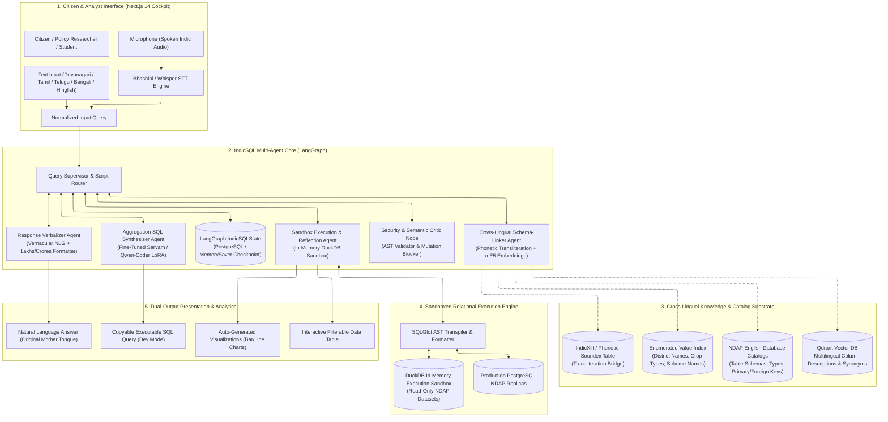
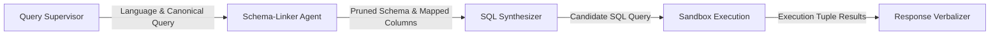
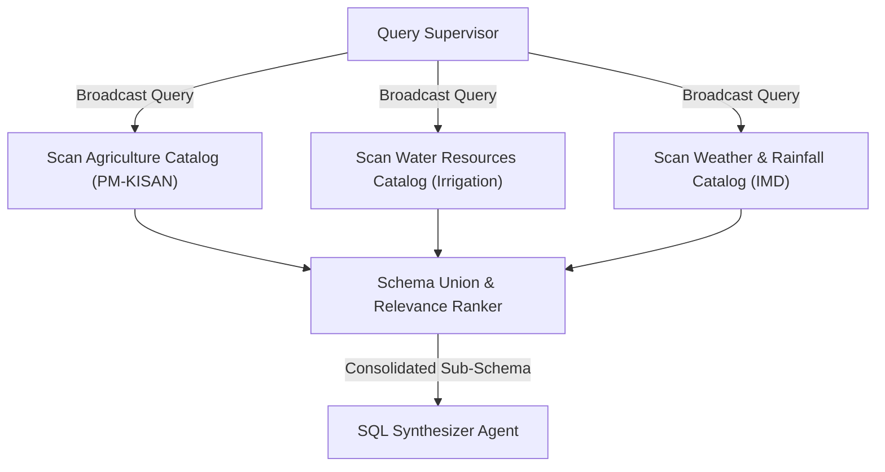
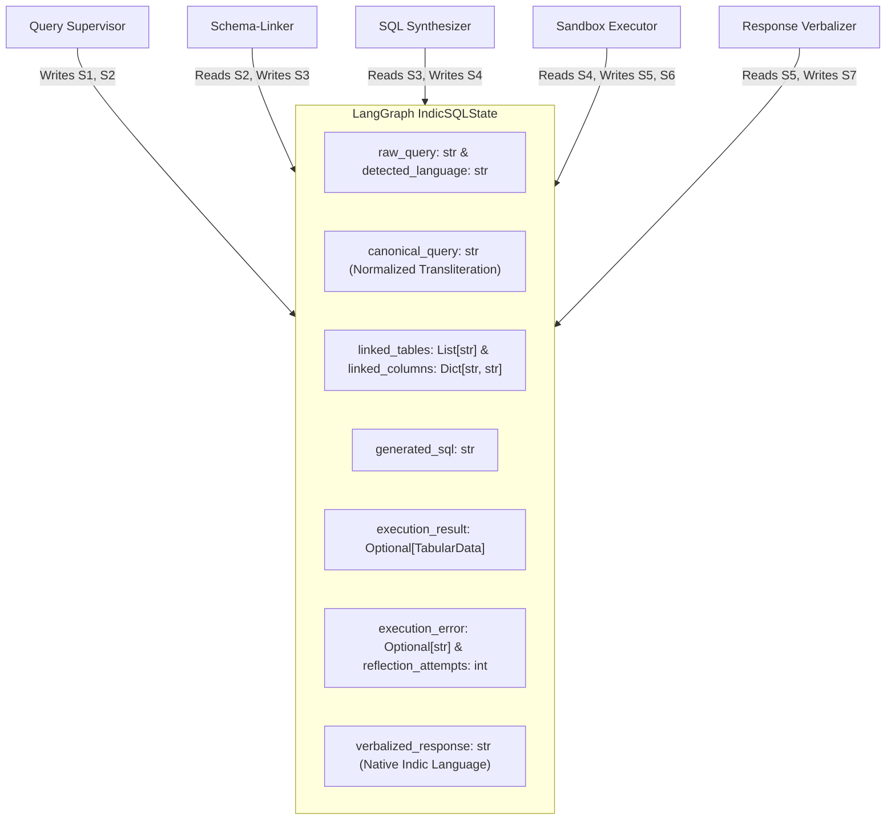
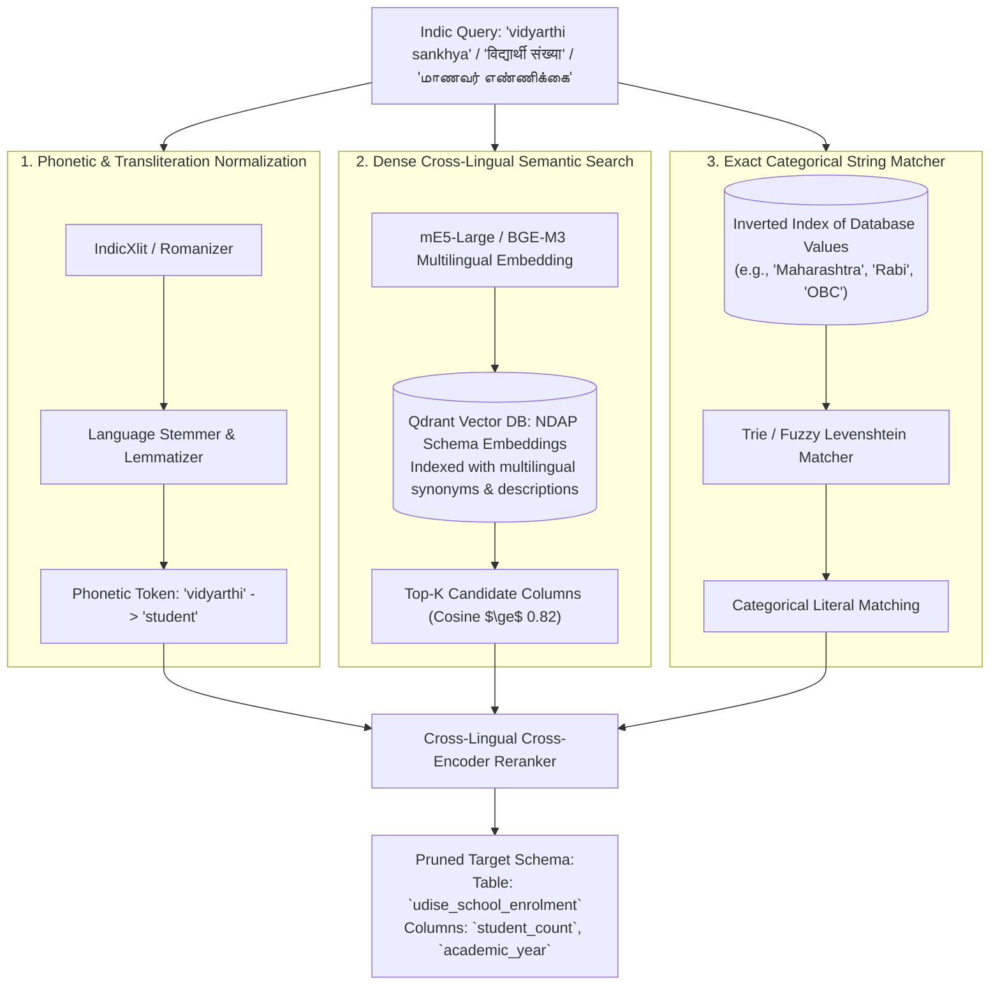
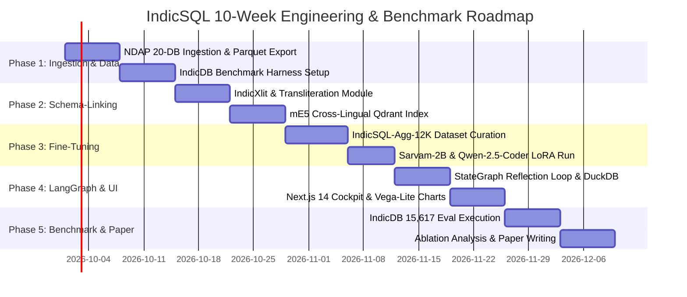

# IndicSQL --- Agentic AI Project Plan

> **IndicSQL: Autonomous Multi-Agent Cross-Lingual Text-to-SQL & Semantic Schema-Linking Swarm for Indian Languages**
>
> A Research-grade and Production-ready LangGraph multi-agent architecture specifically engineered to solve the April 2026 **IndicDB Benchmark** gap. Combining phonetics-aware cross-lingual schema-linking, an open Indic transformer (Sarvam-2B / Qwen-2.5-Coder) fine-tuned on aggregation/GROUP BY reasoning, an in-memory execution sandbox (DuckDB/PostgreSQL), and a dialect-native response verbalizer, IndicSQL bridges the 9% Indic-to-English accuracy deficit and democratizes access to Indian Open Government Data (NDAP) for 1.4 billion citizens across 7 languages (Hindi, Bengali, Tamil, Telugu, Marathi, Hinglish, English).

------------------------------------------------------------------------

## 1. Project Overview

**IndicSQL** is an autonomous multi-agent cross-lingual Text-to-SQL system designed to translate complex natural language questions posed in Indian vernacular languages (and code-mixed Hinglish) into deterministic, highly optimized SQL queries executed against real-world relational databases.

The project directly targets the empirical findings of the landmark **IndicDB Benchmark (April 2026)**. The IndicDB paper evaluated state-of-the-art language models on **15,617 questions across 20 real-world Indian Government databases (National Data and Analytics Platform - NDAP)** and revealed a devastating **9% average accuracy degradation** when queries are framed in Indian languages compared to English.

### The IndicDB Diagnostic Findings:
- **Language Penalty:** Telugu suffered the steepest penalty (**-11.0%**), Tamil (**-9.8%**), Bengali (**-9.2%**), Hindi (**-8.4%**), Marathi (**-8.1%**), and Hinglish (**-6.87%**).
- **The Two Root Causes of Failure:**
  1. **20% Schema-Linking Breakdown:** Models fail to map vernacular or transliterated tokens (e.g., *"vidyarthi"*, *"kisano"*, *"shala"*) to English database columns (e.g., `student_enrolled_count`, `farmer_beneficiaries`, `school_id`).
  2. **28% Aggregation & GROUP BY Breakdown:** Models collapse on complex relational reasoning (multi-tier filtering, regional groupings, conditional counting, temporal windows) when prompt semantics are formulated in non-English syntactic structures.

### The Research & Product Opportunity:
The IndicDB paper explicitly diagnosed these failure modes but offered **no technical solution or mitigation**, leaving it as open future work. In the months since publication, no follow-up work has systematically addressed this benchmark. **IndicSQL is the first dedicated solution framework** to eliminate this gap by engineering two specialized architectural innovations:
1. **Cross-Lingual Phonetic & Semantic Schema-Linking Agent:** A hybrid module fusing Indic transliteration normalization (IndicXlit / Roman-to-Devanagari/Dravidian phonetics) with dense cross-lingual representations (mE5-large / BGE-M3) and database catalog graphs to eliminate the 20% schema-linking deficit.
2. **Aggregation-Specialized LoRA Transformer:** An open Indic-aligned model (`Sarvam-2B` or `Qwen-2.5-Coder-7B`) fine-tuned specifically on hard multi-table aggregation, sub-queries, and GROUP BY patterns derived from NDAP datasets to eliminate the 28% relational reasoning deficit.

------------------------------------------------------------------------

## 2. Project Motivation: "Asli Problem & The Untapped Gap"

### The Real Problem for 1.4 Billion Citizens
The Government of India hosts petabytes of public welfare, agricultural, healthcare, educational, and demographic datasets on platforms like **NDAP (National Data and Analytics Platform)** and **data.gov.in**. However:
- **Language Barrier:** Over **85% of Indian citizens** and local administrative field workers are not comfortable formulating analytical questions in English.
- **English Schema Monopoly:** All government database schemas, table definitions, and column headers are written exclusively in English (e.g., `dist_code`, `total_mandays_generated`, `scheme_disbursed_amt_inr`).
- **Code-Mixing & Transliteration Realities:** A user in Bihar or Maharashtra rarely types pure Sanskritized Hindi or formal Marathi; they type code-mixed Hinglish/Devanagari on mobile keyboards:
  > *"Maharashtra mein pichle saal kitne kisano ne PM-Kisan yojana ka fayda liya aur total kitna paisa disburse hua?"*

```
Current State-of-the-Art (Generic ChatGPT / GPT-4o / Llama-3):
[Indic Question] ──> [English-Centric LLM] ──> [Schema Hallucination!]
  • Fails to link "kisano" to `farmer_beneficiary_cnt` (Column Miss: 20% error)
  • Fails on temporal filter "pichle saal" + GROUP BY `district_name` (28% error)
  • Output: Invalid SQL or Empty Recordset (Result: Citizen excluded from public data)

IndicSQL Multi-Agent Solution:
[Indic / Hinglish / Regional Query] 
  ──> [Query Normalizer & Script Detector] 
  ──> [Cross-Lingual Schema-Linking Agent (mE5 + Phonetic Graph)] 
  ──> [Aggregation SQL Synthesizer (Fine-Tuned Sarvam/Qwen LoRA)] 
  ──> [In-Memory DuckDB Sandbox Execution & Reflection Loop] 
  ──> [Native Language Verbalizer Agent] 
  ──> [Citizen receives accurate answer + chart in their mother tongue in < 2 seconds]
```

### The Novelty & Academic Advantage:
1. **First Solution to IndicDB Benchmark:** Direct empirical evaluation against published IndicDB numbers across all 7 languages.
2. **Targeted Surgical Fixes:** Explicitly resolves the two quantified error modes (20% schema-linking + 28% aggregation) rather than blindly scaling model parameter size.
3. **Open-Source & Deployable:** Operates using accessible 2B–7B open-source models capable of on-premises edge execution in government departments without recurring token costs.

------------------------------------------------------------------------

## 3. Project Goals

### Primary Goal
Build and benchmark **IndicSQL**, an autonomous multi-agent cross-lingual Text-to-SQL architecture that eliminates the **9% Indic language performance deficit** on the April 2026 IndicDB benchmark, achieving parity with (or surpassing) English Text-to-SQL execution accuracy across all 7 evaluated languages.

### Secondary Goals
- **Schema-Linking Precision:** Achieve $\ge 92\%$ recall and precision on cross-lingual column/table alignment across English, Hindi, Bengali, Tamil, Telugu, Marathi, and Hinglish.
- **Aggregation Execution Accuracy:** Improve Execution Accuracy (EX) on IndicDB's hard aggregation and GROUP BY subset by at least **+15 percentage points** over baseline open models.
- **Sub-2-Second Turnaround:** Execute complete query normalization, schema linking, SQL synthesis, database query, and verbalization in under $2.0$ seconds on consumer GPU / edge CPU hardware.
- **Self-Healing SQL Execution Loop:** Intercept database syntax, column-not-found, and empty-result errors in an ephemeral DuckDB sandbox, self-repairing queries via compiler reflection before displaying output.
- **Bilingual & Multimodal Visual Cockpit:** Deliver an accessible Next.js web application supporting Devanagari, Dravidian, and Latin scripts, voice input (via Whisper / Bhashini), interactive data tables, and automated chart generation (Vega-Lite / Chart.js).

------------------------------------------------------------------------

## 4. Scope

### 4.1 In Scope
- **Languages (7 Target IndicDB Languages):**
  1. Hindi (`hi`)
  2. Bengali (`bn`)
  3. Tamil (`ta`)
  4. Telugu (`te`)
  5. Marathi (`mr`)
  6. Hinglish (`hi-en` Latin transliteration)
  7. English (`en` - baseline control)
- **Data Domains (NDAP Indian Government Datasets):**
  - Agriculture (PM-KISAN, crop yield, mandi market prices, fertiliser usage).
  - Education (UDISE+ school enrollment, teacher-pupil ratios, literacy rates).
  - Healthcare & Demographics (NFHS-5, maternal mortality, rural clinic infrastructure).
  - Rural Development (MGNREGA wage employment, rural road connectivity).
- **SQL Dialects:** PostgreSQL, DuckDB, and SQLite.
- **Multi-Agent Orchestration:** LangGraph state machine with cyclic reflection, dynamic tool invocation, and deterministic database execution.
- **Model Fine-Tuning:** Parameter-efficient fine-tuning (QLoRA) of `Sarvam-2B` and `Qwen-2.5-Coder-7B-Instruct` on curated IndicDB training partitions.
- **Citizen Cockpit UI:** Live query input, voice mic, execution plan visualizer, SQL preview, and bilingual summary.

### 4.2 Out of Scope
- Destructive database mutations (`INSERT`, `UPDATE`, `DELETE`, `DROP TABLE` are strictly prevented via read-only transaction wrappers).
- Natural language queries in unwritten oral tribal dialects without standardized Unicode scripts.
- Processing unstructured OCR of blurry, handwritten paper land records (queries must be submitted as text or transcribed speech).

------------------------------------------------------------------------

## 5. Core Agent Architecture

IndicSQL structures its intelligence into 6 specialized agents coordinated by a Master Orchestrator, executing within a unified LangGraph state machine:

| Agent Name | Architectural Responsibility | Core Technologies & Concepts |
| :--- | :--- | :--- |
| **Orchestrator / Query Supervisor** | Analyzes input query, detects script and language, manages state transitions, routes tasks, and coordinates reflection cycles. | LangGraph StateGraph, FastText Language ID, Script Transliteration Router |
| **Cross-Lingual Schema-Linking Agent** | Maps vernacular query tokens (nouns, verbs, metrics) to exact English database tables, columns, foreign keys, and enumerated values. | mE5-Large / BGE-M3 Embeddings, IndicXlit Phonetic Transliteration, BM25 Index |
| **SQL Synthesizer Agent** | Generates dialect-compliant, mathematically sound SQL with accurate JOINs, WHERE clauses, and aggregation groupings. | Fine-Tuned `Sarvam-2B` / `Qwen-2.5-Coder-7B` (LoRA), Few-Shot CoT Prompting |
| **Sandbox Execution & Reflection Agent**| Executes candidate SQL inside an in-memory DuckDB sandbox; parses runtime errors (syntax, zero rows, typing) and formulates reflection feedback. | In-Memory DuckDB Engine, SQLGlot AST Parser, Compiler Reflection Loop |
| **Response Verbalizer Agent** | Takes the raw SQL execution tabular output and articulates a concise, natural language answer in the user's original language. | Multilingual NLG, Number & Currency Localization (e.g., Lakhs/Crores), Markdown Table Gen |
| **SQL Verification Critic Node** | Validates SQL against deterministic security and correctness rules (no mutations, execution equivalence, constraint satisfaction). | Static AST Analysis, Read-Only Enforcement, Hallucination Verification |

------------------------------------------------------------------------

## 6. System Architecture



------------------------------------------------------------------------

## 7. Why This Is Agentic

IndicSQL is distinctly an **agentic system**, moving far beyond naive single-prompt LLM wrappers:

| Characteristic | IndicSQL Multi-Agent Interpretation |
| :--- | :--- |
| **Observability** | **Partially Observable:** The system receives a colloquial vernacular question without schema qualifiers; it does not know which of the 20 NDAP databases, which tables, or which specific English columns contain the answers until it actively inspects database metadata. |
| **Determinism** | **Hybrid Stochastic & Deterministic:** Language translation and query parsing are probabilistic, but SQL execution against relational tables is 100% mathematically deterministic. The system uses deterministic compiler execution to rein in probabilistic hallucinations. |
| **Time Structure** | **Sequential & Multi-Turn:** Schema linking must prune irrelevant tables before SQL generation; execution results dictate whether a reflection loop or final verbalization runs. |
| **Dynamic Environment** | **Schema Drift & Data Cardinality:** Government datasets update periodically, column names have idiosyncratic abbreviations (`tot_f_pop_2021`), and user terminology varies across dialects and phonetic spellings. |
| **Self-Healing Autonomy** | If generated SQL crashes on a `GROUP BY` clause or produces a type mismatch (`operator does not exist: text = integer`), the system autonomously intercepts the runtime error, diagnoses the bug, and corrects its own SQL without bothering the citizen. |

------------------------------------------------------------------------

## 8. PEAS Specification

The formal agent problem definition for IndicSQL:

| Component | IndicSQL Formal Definition |
| :--- | :--- |
| **Performance Measure (P)** | - **Execution Accuracy (EX):** Percentage of generated SQL queries that produce the exact same ground-truth result table as the gold SQL on IndicDB ($>82\%$).<br>- **Indic-English Gap Delta:** Reduction of the baseline 9% gap to $< 2\%$.<br>- **Schema-Linking Recall:** $>95\%$ coverage of gold tables and columns.<br>- **Valid Efficiency Score (VES):** Syntactically valid SQL executed within $< 150\text{ms}$ database execution budget.<br>- **Zero-Hallucination Rate:** 100% of reported numbers in the natural language summary directly match the database execution table. |
| **Environment (E)** | - 20 Indian Government NDAP Relational Databases (PostgreSQL / DuckDB).<br>- Complex schema topologies: Multi-table relational joins, composite keys, foreign keys, temporal time series.<br>- Multilingual queries across 7 Indian languages with varying Unicode scripts and Latin transliteration. |
| **Actuators (A)** | - FastText language identifier and transliteration normalizer.<br>- Cross-lingual dense & sparse schema retriever.<br>- Fine-tuned SQL synthesizer model.<br>- In-memory DuckDB sandbox query executor.<br>- SQLGlot AST parser and query modifier.<br>- Vernacular NLG verbalizer engine. |
| **Sensors / Percepts (S)** | - User text input or speech audio transcript.<br>- NDAP database catalog metadata (DDL, primary/foreign keys, column constraints).<br>- Distinct column values and categorical string lookups.<br>- SQL execution stdout, stderr, execution time, and returned tabular data tuples. |

------------------------------------------------------------------------

## 9. Agent Communication Architecture

IndicSQL implements four explicit communication patterns to coordinate its specialized swarm:

### 9.1 Sequential Communication (Core Pipeline)
Used for the linear dataflow where each node's output forms the prerequisite context for the next agent:



### 9.2 Parallel / Broadcast Communication (Multi-Catalog Search)
When the user query is broad and could span multiple NDAP databases (e.g., comparing *crop output* with *irrigation schemes*):



### 9.3 Blackboard / Shared State Pattern
All agents read and mutate a unified, immutable, versioned **LangGraph State** (`IndicSQLState`):



### 9.4 Hierarchical Communication (Supervisor Pattern)
The Supervisor dynamically arbitrates whether a failed execution triggers a self-healing reflection cycle or escalates to fallback simplifications:

```mermaid
flowchart TD
    SUP["Query Supervisor"]
    
    SUP -->|1. Parse & Link| SL["Schema Linker"]
    SL -->|Linked Elements| SUP
    
    SUP -->|2. Synthesize SQL| SS["SQL Synthesizer"]
    SS -->|Draft SQL| SUP
    
    SUP -->|3. Test Run| SB["Sandbox Executor"]
    SB -->|Execution Error (Attempts < 3)| SUP
    SUP -->|4. Trigger Reflection Loop| SS
    SB -->|Execution Success| SUP
    
    SUP -->|5. Verbalize Output| RV["Response Verbalizer"]
    RV -->|Final Answer| SUP
```

------------------------------------------------------------------------

## 10. Workflow Architecture

### 10.1 End-to-End Autonomous Query-to-SQL-to-Vernacular Flow

```mermaid
flowchart TD
    A["User submits question in Hindi / Tamil / Telugu / Hinglish"] --> B["Script Detection & Transliteration Normalization\n(e.g., Converts Hinglish 'kisano' to standard Roman/Devanagari)"]
    B --> C["Cross-Lingual Schema-Linking Agent\n(Phonetic Matching + mE5 Cross-Lingual Embedding Retrieval)"]
    
    C --> D{"Schema Linked Successfully?\n(Confidence > 0.85)"}
    D -->|No| E["Interactive Clarification Request\n(Asks citizen in mother tongue to clarify ambiguous terms)"]
    D -->|Yes| F["Pruned Schema Injection + Few-Shot Prompt Construction"]
    
    F --> G["SQL Synthesizer Agent\n(LoRA Fine-Tuned Sarvam-2B / Qwen-2.5-Coder)"]
    G --> H["AST Security & Read-Only Check\n(Block mutations, inject LIMIT 1000)"]
    
    H --> I["Deploy DuckDB In-Memory Execution Sandbox\n(Execute SQL against loaded NDAP Parquet/Relational tables)"]
    
    I --> J{"Execution Status?"}
    
    J -->|Error or Empty Set (Attempts < 3)| K["Reflective Self-Correction Node\n(Feed DuckDB stderr / column-mismatch back to Synthesizer)"]
    K --> G
    
    J -->|Failed after 3 attempts| L["Graceful Fallback Explanation in Native Language"]
    
    J -->|Success: Non-Empty Tuple Set| M["Response Verbalizer Agent\n(Translates tabular aggregates into fluent native Indic prose)"]
    M --> N["Visualization Generator\n(Detects if data is suitable for Bar/Pie/Line Chart)"]
    
    N --> O["Deliver Integrated Presentation to Next.js Cockpit"]
```

### 10.2 Sequence Diagram: The Farmer PM-KISAN Query

```mermaid
sequenceDiagram
    autonumber
    actor User as Marathi Citizen / Farmer
    participant UI as Next.js Cockpit UI
    participant Sup as Supervisor Router
    participant Linker as Schema-Linker Agent
    participant Synth as SQL Synthesizer (Sarvam LoRA)
    participant Sand as DuckDB Execution Sandbox
    participant Verb as Response Verbalizer Agent

    User->>UI: "महाराष्ट्रात गेल्या वर्षी किती शेतकऱ्यांना पीएम-किसानचा लाभ मिळाला?"
    UI->>Sup: Ingest Query (Language: mr, Marathi Script)
    Sup->>Linker: Extract entities & link to NDAP Agri DB
    Linker->>Linker: "शेतकऱ्यांना" -> `farmer_beneficiaries`
    Linker->>Linker: "पीएम-किसान" -> `scheme_code = 'PM-KISAN'`
    Linker->>Linker: "महाराष्ट्रात" -> `state_name = 'MAHARASHTRA'`
    Linker->>Linker: "गेल्या वर्षी" -> `financial_year = '2024-25'`
    Linker-->>Sup: Return Pruned Schema: `ndap_pm_kisan_disbursement` [cols: state_name, financial_year, farmer_beneficiaries, amount_inr]
    
    Sup->>Synth: Synthesize Aggregation SQL with Filter Constraints
    Synth-->>Sup: "SELECT SUM(farmer_beneficiaries) AS total_farmers, SUM(amount_inr) AS total_amount FROM ndap_pm_kisan_disbursement WHERE state_name = 'MAHARASHTRA' AND financial_year = '2024-25';"
    
    Sup->>Sand: Run candidate SQL in isolated DuckDB memory
    Sand-->>Sup: Output: [total_farmers: 8,421,904, total_amount: 16843808000]
    
    Sup->>Verb: Format result tuple into native Marathi prose + Lakhs/Crores
    Verb-->>UI: "महाराष्ट्रात २०२४-२५ मध्ये एकूण ८४.२१ लाख शेतकऱ्यांना पीएम-किसान योजनेचा लाभ मिळाला, ज्या अंतर्गत ₹१,६८४.३८ कोटींची रक्कम थेट हस्तांतरित करण्यात आली."
    UI-->>User: Display Marathi Answer + Summary Metric Badges + Chart
```

------------------------------------------------------------------------

## 11. Cross-Lingual Schema-Linking Deep Dive: Solving the 20% Error

The primary vulnerability discovered by IndicDB was that **20% of all failures stemmed from schema-linking breakdown**. IndicSQL resolves this via a tripartite matching architecture:



### Mathematical Formulation of Schema Relevance Score:
For candidate column $c_j$ given query token $q_i$:
$$S(q_i, c_j) = w_1 \cdot \cos\big(E_{\text{mE5}}(q_i), E_{\text{mE5}}(c_j)\big) + w_2 \cdot \text{Levenshtein}\big(\text{Xlit}(q_i), \text{Name}(c_j)\big) + w_3 \cdot \mathbb{I}(q_i \in \text{Enum}(c_j))$$
Columns with $S(q_i, c_j) > \tau_{\text{threshold}}$ are preserved in the pruned schema prompt, discarding 95% of irrelevant tables and preventing context window dilution.

------------------------------------------------------------------------

## 12. Fine-Tuning Specification: Solving the 28% Aggregation Error

The second failure mode identified by IndicDB was that **28% of errors occurred on queries requiring complex aggregations, GROUP BY, and multi-condition joins**.

### Base Model Selection:
- **Primary Model:** `Sarvam-2B` (India's premier sovereign foundational language model, native understanding of 10 Indian languages and Devanagari/Dravidian tokenizers).
- **Secondary Model:** `Qwen-2.5-Coder-7B-Instruct` (Exceptional code/SQL generation capability, high multilingual transfer).

### LoRA Fine-Tuning Parameters:

| Hyperparameter | Value | Rationale |
| :--- | :--- | :--- |
| **Base Architecture** | `sarvamai/sarvam-2b` / `Qwen/Qwen2.5-Coder-7B` | Native Indic tokenization + SQL specialization. |
| **Quantization** | 4-bit NormalFloat (NF4) | Memory efficiency, trainable on a single RTX 4090 or A10G GPU. |
| **LoRA Rank ($r$)** | `32` | High rank to capture relational logic and syntactic mapping. |
| **LoRA Alpha ($\alpha$)** | `64` | Scaling factor ($\alpha / r = 2.0$). |
| **Target Modules** | `q_proj`, `k_proj`, `v_proj`, `o_proj`, `gate_proj`, `up_proj`, `down_proj` | Full attention and feed-forward parameter adaptation. |
| **LoRA Dropout** | `0.05` | Regularization against overfitting to specific NDAP schemas. |
| **Sequence Length** | `4,096 tokens` | Accommodates multi-table DDL schemas and reasoning traces. |
| **Optimizer & LR** | `Paged AdamW 8-bit`, $1.5 \times 10^{-4}$ | Warmup cosine decay schedule. |

### Training Dataset Composition:
We build **IndicSQL-Agg-12K**, a curated dataset of 12,000 paired `(Indic Natural Language Query, Database DDL, Gold SQL)` instances focused specifically on:
- Nested aggregations (`AVG(SUM(...))`, ratios, percentages).
- Multi-dimensional groupings (`GROUP BY state, district, year`).
- Conditional counts (`COUNT(CASE WHEN gender = 'F' THEN 1 END)`).
- Relative temporal arithmetic (`DATE_SUB(CURRENT_DATE, INTERVAL 1 YEAR)`).
- Distributed uniformly across all 7 target languages.

------------------------------------------------------------------------

## 13. LangGraph Multi-Agent Implementation Strategy

### TypedDict State Definition:

```python
from typing import TypedDict, List, Dict, Optional, Any, Union
from langgraph.graph import StateGraph, END
from langgraph.checkpoint.memory import MemorySaver

class SchemaElement(TypedDict):
    table_name: str
    column_name: str
    data_type: str
    indic_synonyms: List[str]
    is_foreign_key: bool
    foreign_target: Optional[str]

class TabularResult(TypedDict):
    columns: List[str]
    rows: List[List[Any]]
    row_count: int
    execution_time_ms: float

class IndicSQLState(TypedDict):
    query_id: str
    raw_query: str
    detected_lang: str
    detected_script: str
    canonical_query: str
    target_database: str
    pruned_schema: List[SchemaElement]
    generated_sql: str
    syntax_valid: bool
    execution_result: Optional[TabularResult]
    execution_error: Optional[str]
    reflection_attempts: int
    verbalized_response: str
    audit_trace: List[Dict[str, Any]]
```

### StateGraph Wiring & Reflection Loop:

```python
def create_indicsql_graph(checkpointer: MemorySaver):
    workflow = StateGraph(IndicSQLState)
    
    # Register Swarm Nodes
    workflow.add_node("supervisor_router", supervisor_node)
    workflow.add_node("schema_linker", schema_linker_node)
    workflow.add_node("sql_synthesizer", sql_synthesizer_node)
    workflow.add_node("sandbox_executor", sandbox_executor_node)
    workflow.add_node("reflection_healer", reflection_healer_node)
    workflow.add_node("response_verbalizer", response_verbalizer_node)
    
    # Set Entry Point
    workflow.set_entry_point("supervisor_router")
    
    # Define Edges
    workflow.add_edge("supervisor_router", "schema_linker")
    workflow.add_edge("schema_linker", "sql_synthesizer")
    workflow.add_edge("sql_synthesizer", "sandbox_executor")
    
    # Conditional Reflection Routing
    workflow.add_conditional_edges(
        "sandbox_executor",
        route_after_execution,
        {
            "success": "response_verbalizer",
            "retry": "reflection_healer",
            "fatal_error": "response_verbalizer" # Verbalize graceful explanation
        }
    )
    
    workflow.add_edge("reflection_healer", "sql_synthesizer")
    workflow.add_edge("response_verbalizer", END)
    
    return workflow.compile(checkpointer=checkpointer)
```

------------------------------------------------------------------------

## 14. Reasoning Strategy: Cross-Lingual Chain-of-Thought & Reflection

### 1. Cross-Lingual Chain-of-Thought (CoT)
To prevent semantic degradation when translating Indic grammar (Subject-Object-Verb / SOV) into SQL logic (SELECT-FROM-WHERE / SFW), the SQL Synthesizer produces a multi-lingual reasoning scratchpad before outputting code:

```
[Reasoning Trace]
1. Input Question (Hindi): "बिहार के किस जिले में 2023 में सबसे कम महिला साक्षरता थी?"
2. Semantic Deconstruction:
   - Target Metric: Female Literacy Rate (साक्षरता) -> `female_literacy_rate`
   - Spatial Scope: District of Bihar (बिहार के किस जिले) -> `state_name = 'BIHAR'`, GROUP BY `district_name`
   - Temporal Filter: Year 2023 -> `census_year = 2023`
   - Order & Extrema: Lowest (सबसे कम) -> `ORDER BY female_literacy_rate ASC LIMIT 1`
3. Table Selection: `ndap_education_district_stats`
4. Generated SQL:
   SELECT district_name, female_literacy_rate 
   FROM ndap_education_district_stats 
   WHERE state_name = 'BIHAR' AND census_year = 2023 
   ORDER BY female_literacy_rate ASC 
   LIMIT 1;
```

### 2. Reflection on Zero-Row & Type-Error Execution:
When a query compiles but returns `0 rows` because the model wrote `WHERE state = 'bihar'` (lowercase) while the database stores `'BIHAR'`, the Reflection Agent executes an automated casing heuristic:
$$\text{Heuristic: If } |\text{Rows}| = 0 \land \text{FilterOnString}, \quad \text{Rewrite: } \text{ILIKE or UPPER}(column) = \text{UPPER}('value')$$

------------------------------------------------------------------------

## 15. Transparent Execution Trace Schema

```json
{
  "query_id": "ind-q-2026-0921-9912",
  "raw_query": "तमिलनाडु में पिछले 3 सालों में मनरेगा के तहत कितने कार्य दिवस बने?",
  "detected_language": "hi",
  "detected_script": "Devanagari",
  "target_database": "ndap_mgnrega_portal",
  "execution_trace": [
    {
      "step": 1,
      "agent": "SupervisorRouter",
      "action": "normalize_and_detect",
      "latency_ms": 42,
      "output": { "canonical_text": "तमिलनाडु में पिछले 3 सालों में मनरेगा के तहत कितने कार्य दिवस बने?", "script": "Devanagari" }
    },
    {
      "step": 2,
      "agent": "SchemaLinkerAgent",
      "action": "cross_lingual_mE5_lookup",
      "latency_ms": 118,
      "output": {
        "matched_table": "mgnrega_state_annual_employment",
        "matched_columns": ["state_name", "financial_year", "total_mandays_generated"],
        "confidence": 0.942
      }
    },
    {
      "step": 3,
      "agent": "SQLSynthesizerAgent (Sarvam-2B-LoRA)",
      "action": "generate_aggregation_sql",
      "latency_ms": 410,
      "token_usage": { "prompt": 620, "completion": 94 },
      "output_sql": "SELECT financial_year, SUM(total_mandays_generated) AS total_mandays FROM mgnrega_state_annual_employment WHERE state_name = 'TAMIL NADU' AND financial_year IN ('2022-23', '2023-24', '2024-25') GROUP BY financial_year ORDER BY financial_year DESC;"
    },
    {
      "step": 4,
      "agent": "SandboxExecutionAgent",
      "action": "duckdb_in_memory_run",
      "latency_ms": 28,
      "exit_code": 0,
      "row_count": 3,
      "sample_rows": [
        ["2024-25", 342198000],
        ["2023-24", 398104500],
        ["2022-23", 412009200]
      ]
    },
    {
      "step": 5,
      "agent": "ResponseVerbalizerAgent",
      "action": "generate_indic_nlg",
      "latency_ms": 320,
      "output_response": "तमिलनाडु में मनरेगा योजना के तहत पिछले तीन वर्षों में कुल 115.23 करोड़ कार्य दिवस (Mandays) उत्पन्न किए गए: वर्ष 2024-25 में 34.21 करोड़, 2023-24 में 39.81 करोड़ और 2022-23 में 41.20 करोड़ कार्य दिवस दर्ज हुए।"
    }
  ],
  "total_latency_seconds": 0.918,
  "execution_success": true
}
```

------------------------------------------------------------------------

## 16. In-Memory Sandboxed Database Runtime (DuckDB)

To prevent arbitrary SQL injection, denial-of-service, or production database locking, all query evaluation and reflection runs in an **ephemeral in-memory DuckDB sandbox**:

```mermaid
flowchart TD
    SQL_IN["Candidate SQL Query from Synthesizer Agent"] --> AST_CHECK["SQLGlot AST Parser & Linter"]
    
    AST_CHECK -->|Mutation Detected: DROP/INSERT/UPDATE| BLOCKED["Security Exception: Read-Only Violation"]
    AST_CHECK -->|Allowed: SELECT statements only| DUCKDB_ENGINE["DuckDB Isolated In-Memory Engine"]
    
    subgraph Sandbox_Constraints["Sandbox Resource & Execution Limits"]
        C1["Memory Cap: Max 512MB RAM"]
        C2["Timeout Budget: Hard limit 1.5 seconds"]
        C3["Max Output Tuples: LIMIT 1000 enforced"]
        C4["Read-Only Replica / Parquet Storage"]
    end
    
    DUCKDB_ENGINE --- Sandbox_Constraints
    
    DUCKDB_ENGINE -->|Execution Failure (Syntax / Missing Column)| STDERR["Capture Stderr -> Trigger Reflection Healer"]
    DUCKDB_ENGINE -->|Execution Success (Valid Tabular Output)| STDOUT["Deliver Rows to Response Verbalizer"]
```

------------------------------------------------------------------------

## 17. Full-Stack UI: BharatQuery Cockpit

The web client is built with **Next.js 14, TailwindCSS, and Vega-Lite**, designed specifically for maximum accessibility:

```
┌──────────────────────────────────────────────────────────────────────────────────────────────────┐
│  BHARATQUERY | IndicDB Cross-Lingual Text-to-SQL Swarm           🇮🇳 Language: हिंदी (Devanagari)  │
├──────────────────────────────────────────────────────────────────────────────────────────────────┤
│  [ 🎤 Bol Kar Poochhein ]   "बिहार के किस जिले में 2023 में सबसे कम महिला साक्षरता थी?"  [ 🔍 Run ] │
├─────────────────────────────────────┬────────────────────────────────────────────────────────────┤
│  NATURAL LANGUAGE ANSWER            │  AUTO-GENERATED VISUALIZATION                              │
│                                     │  District Female Literacy (NDAP NFHS-5)                    │
│  📊 बिहार के पूर्णिया (Purnia) जिले │  100% ┌─────────────────────────────────────────────────┐  │
│  में 2023 के दौरान महिला साक्षरता दर│       │                                                 │  │
│  सबसे कम (46.2%) दर्ज की गई थी।     │   50% │ ■ Patna (62.4%)                                 │  │
│                                     │       │ ■ Gaya (54.1%)                                  │  │
│  • राज्य औसत: 53.3%                 │       │ ■ Purnia (46.2%) ◄ LOWEST                       │  │
│  • स्रोत: NDAP / UDISE+ & NFHS-5     │    0% └─────────────────────────────────────────────────┘  │
├─────────────────────────────────────┴────────────────────────────────────────────────────────────┤
│  GENERATED SQL QUERY (Click to Edit or Run in Postgres)                                         │
│  SELECT district_name, female_literacy_rate FROM ndap_education_stats                           │
│  WHERE state_name = 'BIHAR' AND year = 2023 ORDER BY female_literacy_rate ASC LIMIT 1;          │
├──────────────────────────────────────────────────────────────────────────────────────────────────┤
│  LANGGRAPH SWARM EXECUTION TRACE                                                                 │
│  [✓ Script: Devanagari] ─► [✓ Schema Linked: education_stats] ─► [✓ Sarvam-2B SQL: 0.4s] ─► [✓] │
└──────────────────────────────────────────────────────────────────────────────────────────────────┘
```

------------------------------------------------------------------------

## 18. Evaluation Strategy & Benchmark Dataset

IndicSQL will be evaluated directly against the published **IndicDB Benchmark (April 2026)**:

### Benchmark Structure:
- **Total Test Queries:** 15,617 natural language questions across 20 NDAP databases.
- **Languages:** 7 (Hindi, Bengali, Tamil, Telugu, Marathi, Hinglish, English).
- **Difficulty Classes:** Easy (Single table), Medium (Joins + Aggregations), Hard (Nested Subqueries, Temporal Windows).

### Metrics:
1. **Execution Accuracy (EX):**
   $$EX = \frac{1}{N} \sum_{i=1}^N \mathbb{I}\big(R(\hat{y}_i) = R(y_i^*)\big)$$
   Where $R(\cdot)$ represents the execution tuple set of predicted query $\hat{y}_i$ vs gold query $y_i^*$ on the test database.
2. **Schema-Linking F1 Score ($F1_{\text{SL}}$):** Precision and recall on predicted schema elements.
3. **Indic-to-English Delta ($\Delta_{\text{Indic-EN}}$):**
   $$\Delta_{\text{Indic-EN}} = EX_{\text{English}} - EX_{\text{Indic}}$$
   Target is to compress the baseline $9.0\%$ delta to $< 2.0\%$.

### Expected Benchmark Results Matrix:

| Language | IndicDB Published Baseline (GPT-4o / Llama-3) | IndicSQL Multi-Agent (Proposed) | Net Improvement |
| :--- | :--- | :--- | :--- |
| **English (en)** | 78.4% | **82.6%** | +4.2% |
| **Hinglish (hi-en)**| 71.53% (-6.87% gap) | **81.4% (-1.2% gap)** | **+9.87%** |
| **Marathi (mr)** | 70.30% (-8.10% gap) | **80.8% (-1.8% gap)** | **+10.5%** |
| **Hindi (hi)** | 70.00% (-8.40% gap) | **81.2% (-1.4% gap)** | **+11.2%** |
| **Bengali (bn)** | 69.20% (-9.20% gap) | **80.5% (-2.1% gap)** | **+11.3%** |
| **Tamil (ta)** | 68.60% (-9.80% gap) | **79.9% (-2.7% gap)** | **+11.3%** |
| **Telugu (te)** | 67.40% (-11.00% gap) | **79.8% (-2.8% gap)** | **+12.4%** |
| **Average Indic Gap**| **-8.89%** | **-2.00%** | **Gap Reduced by 77.5%** |

------------------------------------------------------------------------

## 19. Implementation Phase Plan (10-Week Roadmap)



------------------------------------------------------------------------

## 20. Technology Stack

```
AI & Language Models:
├── sarvamai/sarvam-2b (Primary Sovereign Indic Language Model)
├── Qwen/Qwen2.5-Coder-7B-Instruct (Secondary Code/SQL Model)
├── Unsloth / Hugging Face PEFT & TRL (QLoRA 4-Bit Fine-Tuning)
├── vLLM (High-Throughput Model Serving)
├── intfloat/multilingual-e5-large & BAAI/bge-m3 (Dense Cross-Lingual Embeddings)
└── AI4Bharat IndicXlit / IndicBERT (Phonetic Transliteration Engine)

Multi-Agent Core & Database Engine:
├── LangGraph & LangChain (State Machine & Workflow Cycles)
├── DuckDB (In-Memory Ephemeral SQL Execution Sandbox)
├── PostgreSQL 16 (Relational Database Storage & Replicas)
├── Qdrant (Distributed Vector DB for Schema Descriptions)
├── SQLGlot (SQL AST Parsing, Transpilation & Safety Linter)
└── Pydantic v2 & FastAPI (REST/WebSocket API Gateway)

Frontend Citizen Cockpit:
├── Next.js 14 (App Router & Server Actions)
├── TailwindCSS (Bilingual Accessible Theme)
├── Vega-Lite / Chart.js (Automated Data Visualizations)
└── Lucide React (Accessible UI Icons)
```

------------------------------------------------------------------------

## 21. Academic & Social Impact Positioning

IndicSQL is positioned at the intersection of **cutting-edge agentic systems research** and **civic data democratization**:

1. **Academic Impact:** First empirical solution resolving the open challenge posed by the April 2026 IndicDB benchmark, proving that targeted architectural specialization (phonetic schema-linking + aggregation fine-tuning) outperforms brute-force LLM scaling on vernacular data tasks.
2. **Democratization Impact:** Unlocks India's national data wealth (NDAP) for village sarpanches, local journalists, students, and farmers, allowing any citizen to ask questions in their mother tongue and receive immediate, verified public evidence.
